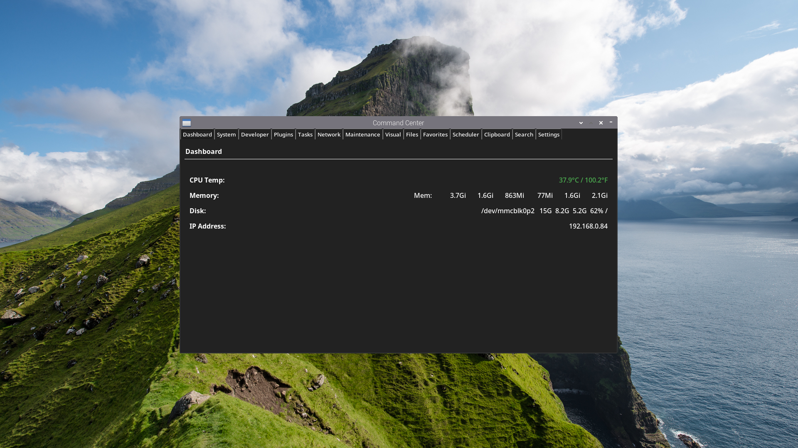
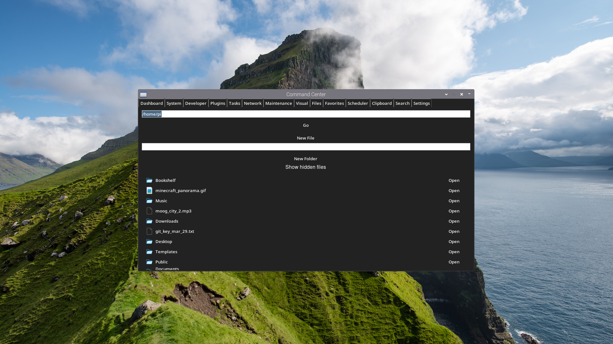

# Control Panel / FireCenter

An all-in-one system control interface built in Python 3.
Designed to give you full control over your system in a not-so-fast, customizable, and extensible interface.

---

# ✨ Features

* 📊 Dashboard for system monitoring
* ⚡ Quick system commands
* 🔌 Plugin support
* 🧠 Task manager
* 📁 File manager
* ⭐ Favorites system
* ⏱️ Command scheduling
* 📋 Visual clipboard
* 🔎 System-wide fuzzy search
* 🎨 Theme support

---

# 🖥️ Supported Systems

## Operating Systems

* Raspberry Pi OS (32-bit or 64-bit)
* Debian / Ubuntu (64-bit recommended)

## Architecture

* ARM (32-bit or 64-bit)
* x86_64 (64-bit)

## Other Requirements

* X11 or XWayland
* Python 3.9+
* A Linux desktop environment:

  * XFCE
  * LXDE
  * MATE
  * GNOME
  * KDE

---

# ⚙️ Setup

## 1. Install Python

Make sure you have Python 3.9 or newer:

```bash
python3 --version
```

If not installed, install it via your package manager.

---

## 2. Download the Project

* Download the latest release
* Extract the zip file wherever you want

---

## 3. Run Installer

```bash
cd /path/to/project
chmod +x install.sh
./install.sh
```

---

# ▶️ How To Run

```bash
python3 menu.py
```

### ⚠️ First Run Note

On the first launch, initialization may take a bit longer.
If it appears to hang, wait a moment, stop it with `Ctrl+C`, and run it again.

---

# 📁 Plugins

Plugins are stored in:

```bash
~/.controlpanel_plugins
```

You can create or modify plugins to extend functionality.

---

# 📝 Notes

* Designed for Linux systems only
* Some features depend on system tools (file manager, terminal, etc.)
* Fully customizable - feel free to modify anything

---

# 🚀 Project Status

This is **v1**.

The goal is to expand with:

* Better performance
* Improved UI/UX
* Cross-environment compatibility

---

# 💬 Final Thoughts

This project has been in development for about 6 months and is built to be explored, modified, and extended.

If you build something cool or improve the experience, contributions are welcome.

---

# 📸 Screenshots



