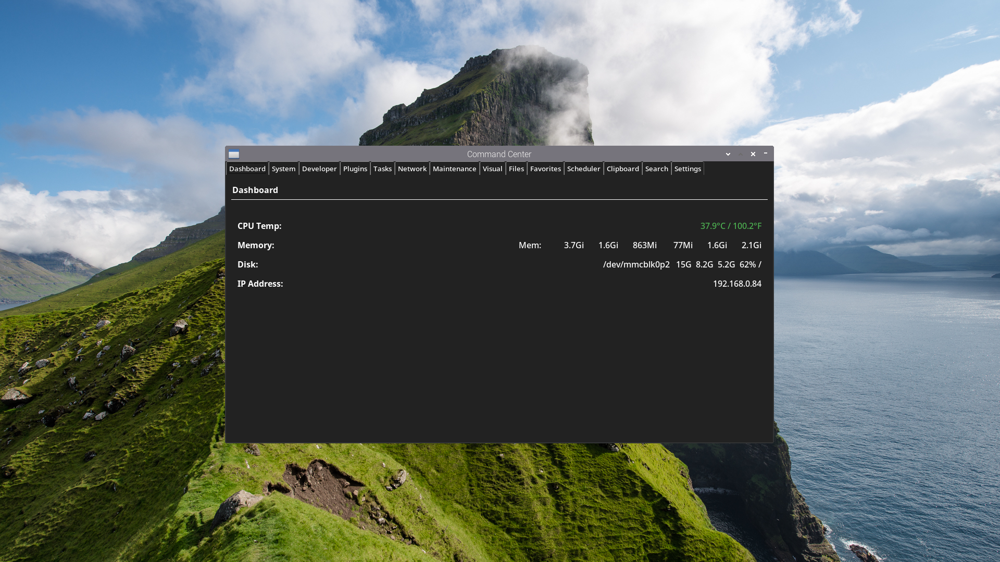
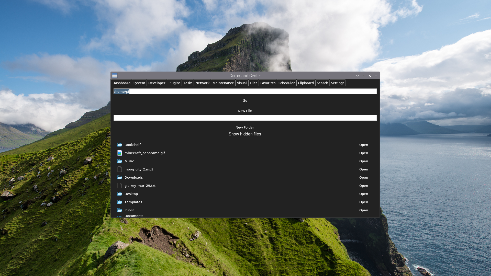

# Control Panel / FireCenter

An all-in-one system control interface built in Python 3 with tkinter.
Designed to give you full control over your system in a not-so-fast, customizable, and semi-improvable interface.

---

# Features

* Dashboard for system monitoring
* Quick system commands
* Plugin support
* Task manager
* File manager
* Favorites system
* Command scheduling
* Visual clipboard
* System-wide fuzzy search
* Theme support

---

# Supported Systems

## Operating Systems

* Raspberry Pi OS (32-bit or 64-bit)
* Debian / Ubuntu (64-bit)

## Architecture

* ARM (32-bit or 64-bit)
* x86_64 (64-bit)

## Other Requirements

* X11 or XWayland
* Python 3.9+
* A Linux desktop environment:

  * XFCE
  * LXDE
  * MATE
  * GNOME
  * KDE

---

# Setup

## 1. Install Python

Make sure you have Python 3.9 or newer:

```bash
python3 --version
```

If it throws an error, install it via your package manager.

For example, in Ubuntu:

```bash
sudo apt-get update && sudo apt-get upgrade
sudo apt install python3
```

---

## 2. Download the Project

* Download the latest release
* Extract the zip file to wherever you want

---

## 3. Run Installer

```bash
cd /path/to/where/you/unzipped/it
chmod +x install.sh
./install.sh
```

---

# How To Run

```bash
source .venv/bin/activate && python main.py
```
OR double click the `.desktop` file (Make sure you have right-clicked it and selected "Allow Launching" or mark it as executable).

### ⚠️ First Run Note

On the first launch, initialization may take a bit longer when run in terminal.
If it appears to hang, wait a moment, stop it with `Ctrl+C`, and run it again.

---

# Plugins

Plugins are stored in:

```bash
/path/to/where/you/unzipped/it/.controlpanel_plugins/
```

You can create or modify plugins to extend functionality. All plugins should in Python format.

---

# Notes

* Designed for Linux systems only
* Some features depend on system tools (file manager, terminal, etc.)
* Fully customizable - feel free to modify anything

---

# Project Status

This is **v1** (not including extra updates).

The goal is to improve with:

* Better performance
* Improved UI/UX
* Cross-environment compatibility (hopefully with windows someday)

---

This project has been in development for about 6 months and should be modified and extended.

If you build some cool plugin and want it to be included, or you have ideas to improve the experience, contributions are welcome.

---

# Screenshots



